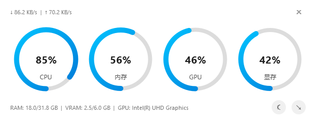

# Lite-Gauge

一个简洁的 Windows 桌面性能监控小工具，用圆环仪表显示 CPU、内存、GPU 和显存占用，并实时显示上传、下载速度。



## 功能

- **实时监控**：约每秒刷新一次 CPU、内存、GPU 和显存数据。
- **用量与型号**：显示内存、显存的已用容量与总容量，以及 GPU 型号。
- **网络速度**：显示系统网络接口汇总的上传、下载速度。
- **桌面悬浮**：窗口始终置顶，可拖动位置，也可一键移至屏幕右下角。
- **明暗主题**：支持手动切换浅色和深色外观。

## 使用方法

使用已打包的程序时，无需安装 Python。

1. 将程序完整解压到一个文件夹。
2. 双击 `LiteGauge.exe` 启动。
3. 拖动窗口空白处调整位置；点击右下角月亮 / 太阳按钮切换主题，点击箭头按钮移至右下角。
4. 点击右上角 `×` 退出。

项目的打包输出位于 `dist/`，目录结构如下：

```text
dist/
├── LiteGauge.exe          # 启动器
└── LiteGauge/
    ├── LiteGauge.exe      # 主程序，也可以直接运行
    └── _internal/         # 运行依赖
```

移动或分发程序时，请保留完整目录。外层 `LiteGauge.exe` 是启动器，不能脱离 `LiteGauge/` 文件夹单独使用。

## 数据说明

- **GPU 占用**：优先读取 Windows GPU 性能计数器，显示当前最繁忙的 GPU 引擎占用；多显卡环境下，型号会随选中的 GPU 变化。
- **显存占用**：目前通过 NVIDIA NVML 获取，需要受支持的 NVIDIA 显卡和驱动。无法读取时，显存圆环显示 `0%`，底部不显示显存容量，这不代表实际显存用量为零。
- **多显卡设备**：GPU 占用与显存数据分别获取，可能来自不同显卡。
- **无法识别 GPU**：`Windows GPU` 表示已读到占用但未解析到型号；`Not Detected` 表示未获取到可用的 GPU 占用数据。

## 从源码运行

已在 Windows、Python 3.11 环境下验证。进入项目目录后，在 PowerShell 中执行：

```powershell
python -m venv .venv
.\.venv\Scripts\python.exe -m pip install PyQt6 psutil nvidia-ml-py
.\.venv\Scripts\python.exe start.py
```

`nvidia-ml-py` 提供 NVIDIA 显存监控；没有 NVIDIA 显卡时可以省略，Windows GPU 占用和型号识别不依赖它。

请通过 `start.py` 启动，并保持只运行一个实例。界面与采样服务使用本机端口 `6000` 通信，重复启动或端口被占用会影响数据获取。

<details>
<summary>开发与打包</summary>

运行回归测试：

```powershell
.\.venv\Scripts\python.exe -m unittest discover -s tests -v
```

使用目录模式打包主程序，再生成外层启动器：

```powershell
.\.venv\Scripts\python.exe -m pip install pyinstaller
.\.venv\Scripts\python.exe -m PyInstaller --noconfirm LiteGauge-onedir.spec
.\.venv\Scripts\python.exe -m PyInstaller --noconfirm LiteGauge-launcher.spec
```

打包前先关闭正在运行的旧程序。输出位于 `dist/`，分发时将整个 `dist/` 目录打包。当前目录构建用于保留 Qt 运行库布局；`LiteGauge.spec` 是旧的单文件方案，不作为上述构建流程的入口。

</details>
